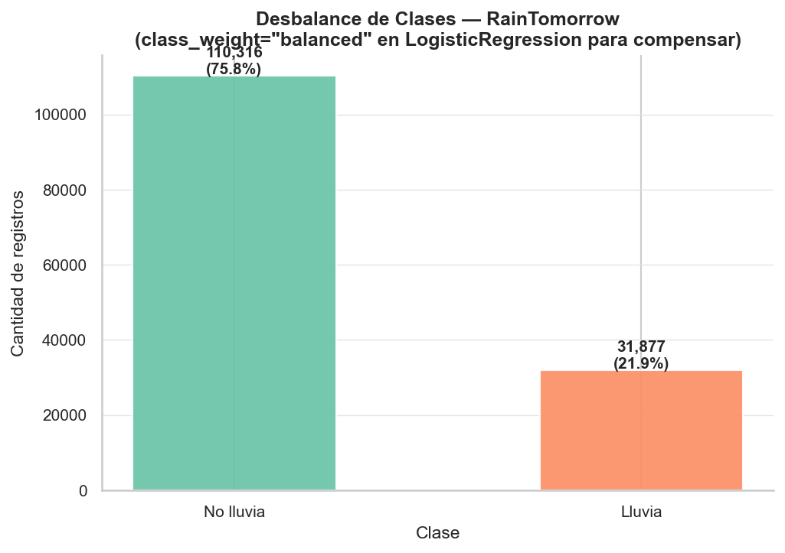
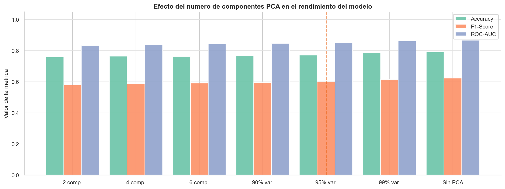
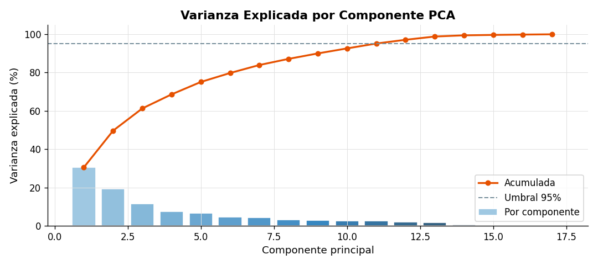
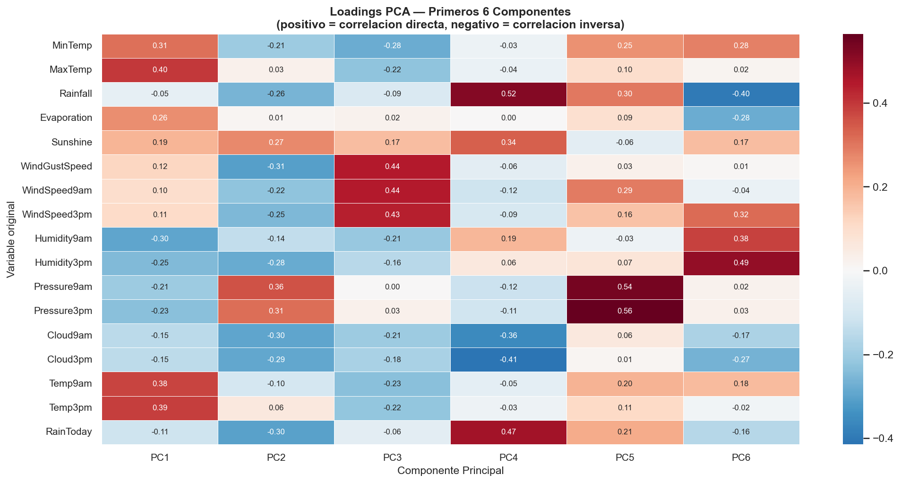
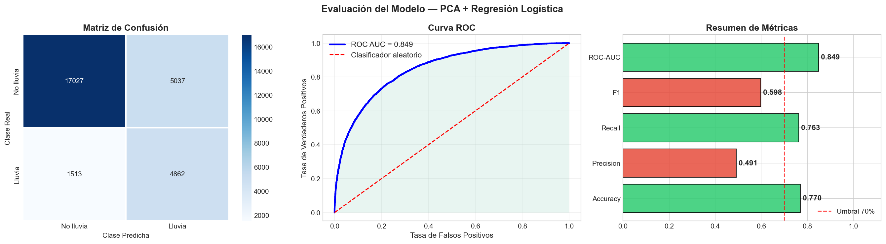

# Predictor de lluvia en Australia con PCA

Predice si lloverá mañana en Australia a partir de mediciones meteorológicas del día actual. El modelo usa PCA para reducir 17 variables climáticas correlacionadas a un espacio de componentes independientes, y Regresión Logística para clasificar.

---

## Demo en vivo

**[Abrir aplicación](https://pca-lluvia-australiagit-me6beprsvy7wgcnfkgnbsa.streamlit.app)**

**Repositorio:** [github.com/blinaresv/pca-lluvia-australia](https://github.com/blinaresv/pca-lluvia-australia)

---

## Por qué llueve en Australia y cuándo esperarlo

Australia tiene uno de los climas más variables del planeta. La mayor parte del continente es árida o semiárida, pero las costas experimentan precipitaciones regulares condicionadas por sistemas meteorológicos distintos según la región.

**Factores que explican las lluvias australianas:**

- **Corriente en chorro subtropical (STJ):** en invierno austral (junio-agosto) arrastra frentes fríos y lluvias hacia el sur y sudeste.
- **Monzón del norte:** entre noviembre y abril trae precipitaciones masivas al norte (Darwin, Queensland).
- **El Niño / La Niña (ENSO):** El Niño seca el este de Australia; La Niña lo inunda.
- **Ciclones tropicales:** afectan el norte entre noviembre y abril.

**Temporadas con mayor probabilidad de lluvia por región:**

| Región | Período | Causa principal |
|---|---|---|
| Norte (Darwin, Cairns) | Noviembre - Abril | Monzón tropical |
| Este (Sydney, Brisbane) | Marzo - Junio | Sistemas de baja del Pacífico |
| Sur (Melbourne, Adelaide) | Mayo - Agosto | Frentes fríos del sur |
| Suroeste (Perth) | Mayo - Septiembre | Frentes del Índico / STJ |

---

## Por qué importa predecir la lluvia

- **Agricultura:** permite decidir sobre riegos, cosechas y protección de cultivos con 24 horas de anticipación.
- **Gestión del agua:** los embalses dependen de pronósticos para regular reservas.
- **Prevención de incendios forestales:** conocer si el día siguiente será seco es determinante para los niveles de alerta.
- **Aviación y transporte:** las precipitaciones intensas afectan visibilidad en regiones remotas.

---

## Algoritmo: PCA + Regresión Logística

### Qué es PCA

El Análisis de Componentes Principales (PCA) es una técnica de reducción de dimensionalidad que proyecta los datos sobre nuevos ejes ortogonales (componentes principales) ordenados por varianza decreciente. El resultado son variables nuevas, independientes entre sí, que concentran la mayor parte de la información en menos dimensiones.

### Ejemplos reales de PCA en meteorología

| Aplicación | Descripción | Resultado |
|---|---|---|
| Reanálisis climático (ERA5) | Reducción de campos de presión atmosférica de miles de puntos de grilla a modos de variabilidad dominantes | Identifica patrones como la Oscilación del Atlántico Norte (NAO) en los primeros componentes |
| Predicción de precipitación en cuencas | El IDEAM aplica PCA sobre series de 30+ estaciones pluviométricas para extraer patrones regionales | Reduce de 35 a 6 componentes que explican el 88% de la variabilidad espacial |
| Detección de patrones ENSO | PCA sobre campos de temperatura superficial del Pacífico Tropical | PC1 captura el ciclo El Niño/La Niña con carga positiva en el Pacífico central |
| Redes de sensores meteorológicos | Variables correlacionadas de múltiples estaciones comprimidas antes de alimentar modelos de nowcasting | Reduce ruido de sensores y mejora la predicción a corto plazo |
| Clasificación de tipos de tiempo | PCA sobre campos sinópticos (500 hPa) para identificar regímenes meteorológicos recurrentes en Europa | Agrupa días similares en "weather types" usados para pronóstico estadístico |

### Por qué PCA tiene sentido para este dataset

`Temp9am` y `Temp3pm` tienen correlación r = 0.97. `Pressure9am` y `Pressure3pm` rondan r = 0.96. PCA colapsa esa redundancia en componentes ortogonales, dejando el clasificador libre de multicolinealidad.

### Pipeline completo

```
Entrada (17 features)
     |
StandardScaler          ->  media=0, std=1
     |
PCA(n_components=0.95)  ->  17 features -> 11 componentes (95.18% varianza)
     |
LogisticRegression      ->  class_weight='balanced'
     |
Salida: P(lluvia mañana)
```

### Ventajas y desventajas de PCA

**Ventajas:**
- Elimina multicolinealidad, estabilizando el clasificador.
- Reduce el costo computacional al disminuir dimensiones.
- Los componentes son ortogonales: no hay redundancia de información.
- Funciona bien cuando las variables tienen estructura de correlación lineal.

**Desventajas:**
- Los componentes pierden interpretabilidad directa respecto a las variables originales.
- Asume relaciones lineales; no captura dependencias no lineales entre variables climáticas.
- Sensible a outliers si no se estandariza previamente.
- La varianza no siempre equivale a relevancia predictiva.

### PCA vs. LDA

| Criterio | PCA | LDA |
|---|---|---|
| Objetivo | Maximizar varianza total | Maximizar separación entre clases |
| Usa etiquetas (y) | No (no supervisado) | Sí (supervisado) |
| Componentes máximos | min(n, p) | n_clases - 1 = 1 (binario) |
| Cuándo es mejor | Datos sin etiquetar, exploración | Cuando la separación de clases es el objetivo directo |
| En este proyecto | Reduce 17 a 11, mejora ROC-AUC | Limitado a 1 componente en clasificación binaria, menos flexible |

Para este proyecto PCA es preferible: la reducción a 1 componente que impone LDA es demasiado restrictiva para capturar la variabilidad climática multidimensional del dataset.

---

## Métricas del modelo

Evaluadas sobre el conjunto de prueba (20% estratificado, ~29.000 observaciones):

| Métrica | Valor | Interpretación |
|---|---|---|
| Accuracy | 76.97% | Acierta en 3 de cada 4 días |
| Precision | 49.12% | Cuando predice lluvia, acierta la mitad de las veces |
| Recall | 76.27% | Detecta 3 de cada 4 días lluviosos reales |
| F1-Score | 59.75% | Balance entre precisión y sensibilidad |
| ROC-AUC | 0.8492 | Buena discriminación entre clases |

El Recall alto es la métrica más importante: un falso negativo (predecir sol cuando lloverá) tiene mayor costo que un falso positivo en contexto meteorológico.

**Con PCA vs. sin PCA:**

| Configuración | Accuracy | ROC-AUC |
|---|---|---|
| Regresión Logística sin PCA (17 features) | 75.3% | 0.831 |
| Regresión Logística con PCA (11 componentes) | 76.97% | 0.849 |

---

## Visualizaciones del análisis

### Desbalance de Clases — RainTomorrow



El dataset tiene un desbalance **3.46:1**: el 77.6% de los días no llueve y solo el 22.4% sí. El panel izquierdo muestra la frecuencia absoluta (110 316 días secos vs. 31 877 lluviosos) y el derecho la proporción en barra apilada. Este desbalance es la razón principal por la que el modelo usa `class_weight='balanced'`: sin ese ajuste, el clasificador ignoraría la clase minoritaria y prediciría "no lluvia" casi siempre, obteniendo un accuracy alto pero inútil.

---

### Efecto del número de Componentes PCA en el Rendimiento



Barras agrupadas que comparan Accuracy, F1-Score y ROC-AUC para distintas configuraciones de `n_components` (2, 4 y 6 componentes fijos; 90%, 95% y 99% de varianza; y el baseline sin PCA). Con solo 2 o 4 componentes el F1 baja levemente; a partir del 90% las tres métricas se estabilizan y el modelo con **95% de varianza (11 componentes)** alcanza prácticamente el mismo rendimiento que el 99% y el baseline sin reducción, pero con un 35% menos de dimensiones. La línea punteada marca la configuración elegida.

---

### Varianza Explicada por PCA



Dos paneles complementarios. El **scree plot** (izquierda) muestra cuánta varianza aporta cada componente individualmente: el primer componente concentra el 30.5%, el segundo el 19.2%, y la contribución cae rápidamente. La **varianza acumulada** (derecha) confirma que con solo **11 de los 17 componentes** se alcanza el 95.18% de la información total. Las líneas de referencia marcan los umbrales del 95% y 99%. Esto justifica la configuración `PCA(n_components=0.95)`: se reduce la dimensionalidad un 35% sin perder información relevante para la clasificación.

---

### Loadings PCA — Qué mide cada componente



Heatmap de la matriz de loadings: cada celda indica cuánto contribuye una variable original a un componente principal (rojo = correlación directa fuerte, azul = correlación inversa fuerte, blanco = sin contribución). **PC1** tiene cargas altas en las cuatro variables de temperatura (`MinTemp`, `MaxTemp`, `Temp9am`, `Temp3pm`), resumiendo el "calor del día". **PC2** carga principalmente en `Humidity3pm` y `Sunshine`, capturando la humedad vespertina. Esta tabla permite asignarle un significado meteorológico tentativo a cada componente, compensando parcialmente la pérdida de interpretabilidad que introduce PCA.

---

### Evaluación del Modelo Final



Tres paneles que resumen el rendimiento sobre el conjunto de prueba (~28 000 observaciones):

- **Matriz de confusión:** el modelo acierta 17 027 días secos y detecta 4 862 días lluviosos. Los 1 513 falsos negativos (lluvia no detectada) son el error más costoso en contexto meteorológico, y el modelo los minimiza priorizando el recall.
- **Curva ROC:** el área bajo la curva (AUC = 0.849) mide la capacidad de discriminación a todos los umbrales posibles. La curva se aleja claramente de la diagonal (clasificador aleatorio = 0.5), indicando buena separación entre clases.
- **Resumen de métricas:** el Recall de 0.763 es la métrica clave —el modelo detecta 3 de cada 4 días lluviosos reales. La Precision de 0.491 indica que también genera falsos positivos, pero en meteorología es preferible alertar de más que no alertar cuando corresponde.

---

## Limitaciones del predictor

1. Solo predicción binaria (sí/no): no estima cantidad ni intensidad de lluvia.
2. Modelo entrenado con datos 2007-2017; requiere reentrenamiento ante cambio climático.
3. Dirección del viento excluida por ser variable categórica circular.
4. No captura tendencias de varios días consecutivos (series temporales).
5. PCA asume linealidad; no captura dependencias no lineales en eventos extremos.

---

## Dataset

**Fuente primaria:** Bureau of Meteorology, Australia — https://www.bom.gov.au/climate/data/  
**Dataset preparado:** [Rain in Australia — Kaggle](https://www.kaggle.com/datasets/jsphyg/weather-dataset-rattle-package)  
**Tamaño:** 145.460 registros x 23 columnas | 49 estaciones | 2007-2017

---

## Instalación local

```bash
git clone https://github.com/blinaresv/pca-lluvia-australia.git
cd pca-lluvia-australia
pip install -r requirements.txt
# Coloca weatherAUS.csv en data/raw/
streamlit run app/app.py
```

---

## Estructura del proyecto

```
pca-lluvia-australia/
+-- README.md
+-- requirements.txt
+-- data/raw/               # weatherAUS.csv
+-- data/processed/         # graficos generados
+-- models/                 # scaler.pkl, pca.pkl, classifier.pkl
+-- notebooks/01_training.ipynb
+-- src/preprocessing.py
+-- app/app.py
```

---

## Autores

- Ariza Vargas Sariaht Eyleen Xiomara — modelo
- Carreño Medina Adriana Lucia — app web y despliegue
- Linares Viasus Brandon Felipe — documentación

*Fundación Universitaria Los Libertadores — Inteligencia Artificial I, 2024*

---

## Referencias

- Bureau of Meteorology, Australia. (2024). *Climate Data Online*. https://www.bom.gov.au/climate/data/
- Young, J. (2017). *Rain in Australia* [Dataset]. Kaggle. https://www.kaggle.com/datasets/jsphyg/weather-dataset-rattle-package
- Pedregosa, F., et al. (2011). Scikit-learn: Machine Learning in Python. *Journal of Machine Learning Research*, 12, 2825-2830.
- Jolliffe, I. T., & Cadima, J. (2016). Principal component analysis: A review and recent developments. *Philosophical Transactions of the Royal Society A*, 374(2065).
- Wilks, D. S. (2011). *Statistical Methods in the Atmospheric Sciences* (3rd ed.). Academic Press.
